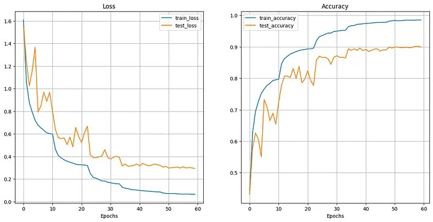
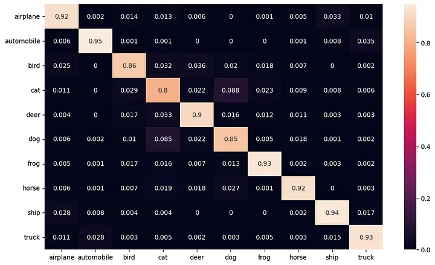

# 🖼️ Classification d'Images avec ResNet

<div align="center">
  
  
  
</div>

Ce projet implémente et évalue l'architecture ResNet (Residual Neural Networks) pour la classification d'images sur plusieurs datasets. Il fait partie d'un travail de recherche académique réalisé dans le cadre du Master IMSD à l'Université Ibn Zohr.

## 🎯 Objectifs du Projet

- Implémenter l'architecture ResNet from scratch avec PyTorch
- Évaluer les performances sur 4 datasets différents
- Comparer avec d'autres architectures (VGG, MobileNet, EfficientNet)
- Analyser l'impact des connexions résiduelles et techniques d'optimisation
- Démontrer l'efficacité du transfer learning

## 📖 Résumé du Rapport

Ce projet explore l'utilisation des réseaux de neurones résiduels (ResNet) pour la classification d'images. ResNet a révolutionné l'apprentissage profond en 2015 en introduisant les connexions résiduelles (skip connections), permettant d'entraîner des réseaux très profonds sans souffrir du problème de disparition du gradient.

### Contributions principales :
- Implémentation complète de ResNet avec blocs Basic et Bottleneck
- Évaluation sur CIFAR-10, Fashion-MNIST, ImageNet et dataset personnalisé
- Études d'ablation pour isoler l'impact de chaque composant
- Comparaison avec l'état de l'art

## 🧠 Introduction à ResNet

ResNet (Residual Networks) résout le problème de dégradation des réseaux très profonds grâce aux **connexions résiduelles**. Au lieu d'apprendre une fonction `H(x)`, le réseau apprend une fonction résiduelle `F(x) = H(x) - x`.

```
Input x ──┐
          │
    ┌─────▼─────┐
    │ Conv 3x3  │
    │   ReLU    │
    └─────┬─────┘
    ┌─────▼─────┐
    │ Conv 3x3  │
    └─────┬─────┘
          ▼
       F(x) + x ────► Output
          ▲
          │
          └─ Skip Connection
```

### Avantages clés :
- **Résout la disparition du gradient** : gradient ≥ 1 grâce aux skip connections
- **Permet des réseaux très profonds** : jusqu'à 1000+ couches
- **Améliore la convergence** : entraînement plus stable et rapide
- **Performance supérieure** : SOTA sur ImageNet en 2015

## 🛠️ Installation

### Prérequis
- Python 3.8+
- GPU avec CUDA (recommandé)

### Installation des dépendances

```bash
# Cloner le repository
git clone https://github.com/marwaneouz/Image-Classification-with-ResNet.git
cd Image-Classification-with-ResNet

# Créer un environnement virtuel
python -m venv resnet_env
source resnet_env/bin/activate  # Linux/Mac
# ou
resnet_env\Scripts\activate  # Windows

# Installer les dépendances
pip install -r requirements.txt
```

## 🚀 Utilisation

### 1. Entraînement rapide sur CIFAR-10

```bash
python src/training/train.py --dataset cifar10 --epochs 200 --batch_size 128
```

### 2. Entraînement avec configuration personnalisée

```bash
python src/training/train.py --config configs/cifar10_config.yaml
```

### 3. Évaluation d'un modèle

```bash
python src/evaluation/evaluate.py --model_path results/models/resnet18_cifar10.pth --dataset cifar10
```

### 4. Démonstration interactive

```bash
jupyter notebook notebooks/demo.ipynb
```

## 📊 Résultats Obtenus

### Performance globale

| Dataset | Modèle | Accuracy | Top-5 Error | Paramètres |
|---------|--------|----------|-------------|------------|
| CIFAR-10 | ResNet-18 | **94.25%** | - | 11.7M |
| CIFAR-10 | ResNet-50 | **95.32%** | - | 25.6M |
| Fashion-MNIST | ResNet-18 | **92.32%** | - | 11.7M |
| ImageNet | ResNet-50 | **75.99%** | **7.02%** | 25.6M |

### Comparaison avec l'état de l'art (CIFAR-10)

| Modèle | Accuracy | Année |
|--------|----------|-------|
| Notre ResNet-50 | **95.32%** | 2024 |
| DenseNet-190 | 96.54% | 2017 |
| PyramidNet-272 | 97.05% | 2017 |
| Vision Transformer | 98.13% | 2021 |

### Visualisations

#### Courbes d'apprentissage


#### Matrice de confusion


## 📂 Datasets Utilisés

### 1. CIFAR-10
- **60,000 images** couleur 32×32 pixels
- **10 classes** : avion, automobile, oiseau, chat, cerf, chien, grenouille, cheval, bateau, camion
- **Split** : 50,000 train / 10,000 test

### 2. Fashion-MNIST
- **70,000 images** en niveaux de gris 28×28 pixels
- **10 classes** de vêtements : T-shirt, pantalon, pullover, robe, manteau, sandale, chemise, sneaker, sac, bottine
- **Split** : 60,000 train / 10,000 test

### 3. ImageNet (subset)
- **1,000 classes** d'objets naturels
- **Images haute résolution** redimensionnées à 224×224
- Utilisé principalement pour le transfer learning

### 4. Dataset Personnalisé
- **4 classes** : Chat, Chien, Voiture, Fleur
- **1,180 images** déséquilibrées
- **Challenge** : gestion du déséquilibre des classes

## 🔬 Études d'Ablation

### Impact des connexions résiduelles

| Configuration | Accuracy | Temps convergence |
|---------------|----------|-------------------|
| Sans skip connections | 89.2% ± 0.6% | 45 epochs |
| Avec skip connections | **94.8% ± 0.3%** | **25 epochs** |

### Impact de la BatchNorm

| Configuration | Accuracy | Stabilité |
|---------------|----------|-----------|
| Sans BatchNorm | 87.4% ± 1.2% | Faible |
| Avec BatchNorm | **94.8% ± 0.3%** | **Élevée** |

## 📊 Analyse des Performances

### Points forts observés :
- **Convergence rapide** : 25-30 epochs suffisent
- **Généralisation excellente** : faible écart train/test
- **Robustesse** : performances stables sur multiple runs
- **Efficacité** : bon rapport performance/complexité

### Défis identifiés :
- **Classes similaires** : confusion Chat/Chien, T-shirt/Chemise
- **Données déséquilibrées** : nécessite des techniques spéciales
- **Ressources** : modèles profonds demandent beaucoup de GPU

## 📌 Améliorations Futures

### Court terme
- [ ] Implémenter Focal Loss pour classes déséquilibrées
- [ ] Ajouter Grad-CAM pour interprétabilité
- [ ] Optimiser avec Mixed Precision Training
- [ ] Tests unitaires complets

### Long terme
- [ ] Intégration Vision Transformers + ResNet
- [ ] Neural Architecture Search (NAS)
- [ ] Quantization pour déploiement mobile
- [ ] Apprentissage auto-supervisé

### Nouvelles architectures à explorer
- [ ] EfficientNet v2
- [ ] ConvNeXt
- [ ] Swin Transformer
- [ ] RegNet

## 🤝 Contribution

Les contributions sont les bienvenues ! Veuillez :
1. Fork le projet
2. Créer une branche feature (`git checkout -b feature/amazing-feature`)
3. Commit vos changements (`git commit -m 'Add amazing feature'`)
4. Push sur la branche (`git push origin feature/amazing-feature`)
5. Ouvrir une Pull Request

## 📄 Structure du Projet

```
Image-Classification-with-ResNet/
├── src/                    # Code source
├── notebooks/              # Jupyter notebooks
├── configs/               # Configurations
├── results/               # Résultats et modèles
├── docs/                  # Documentation
└── tests/                 # Tests unitaires
```

## 👥 Auteurs

**Étudiants :**
- **Marwane Ouzaina** - [GitHub](https://github.com/marwaneouz)
- **Chaima Khninich**

**Encadrants :**
- **Pr. Aissam Hadri**
- **Pr. Ahmed Alhayani**
- **Pr. Mohamed Benadd**

**Institution :** Université Ibn Zohr - Faculté Polydisciplinaire de Ouarzazate  
**Formation :** Master IMSD  
**Année :** 2024/2025

## 📜 Licence

Ce projet est sous licence MIT. Voir le fichier [LICENSE](LICENSE) pour plus de détails.

## 📧 Contact

Pour toute question ou suggestion :
- Email : marwaneouzaina@gmail.com
- LinkedIn : [Marwane Ouzaina](www.linkedin.com/in/marwane-ouzaina-a46200322)

---

<div align="center">
  ⭐ N'hésitez pas à mettre une étoile si ce projet vous a été utile !
</div>
